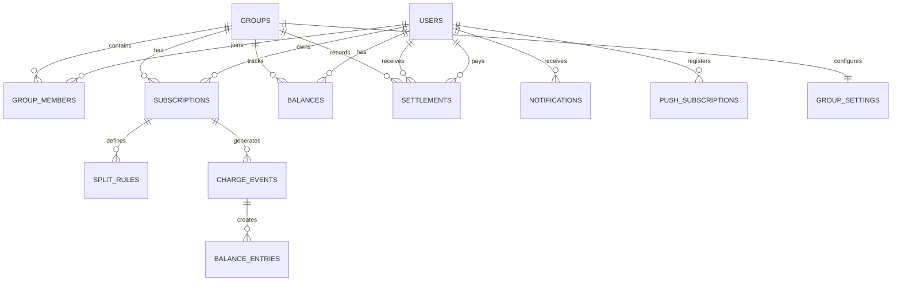

# SubSplit — Technical Specification

> Derived from [idea.md](file:///c:/Users/nilak/OneDrive/Desktop/SubSplit/idea.md) and [requirements.md](file:///c:/Users/nilak/OneDrive/Desktop/SubSplit/requirements.md)

---

## Table of Contents

1. [System Overview](#1-system-overview)
2. [Architecture](#2-architecture)
3. [Tech Stack & Rationale](#3-tech-stack--rationale)
4. [Project Structure](#4-project-structure)
5. [Database Design](#5-database-design)
6. [Authentication & Authorization](#6-authentication--authorization)
7. [Gmail Integration Service](#7-gmail-integration-service)
8. [Subscription Parsing Engine](#8-subscription-parsing-engine)
9. [Recurring Detection Engine](#9-recurring-detection-engine)
10. [Split & Balance Engine](#10-split--balance-engine)
11. [Notification System](#11-notification-system)
12. [Payment Link Generator](#12-payment-link-generator)
13. [API Specification](#13-api-specification)
14. [Frontend Architecture](#14-frontend-architecture)
15. [Background Jobs & Scheduling](#15-background-jobs--scheduling)
16. [Security Design](#16-security-design)
17. [Error Handling Strategy](#17-error-handling-strategy)
18. [Testing Strategy](#18-testing-strategy)
19. [Deployment & Infrastructure](#19-deployment--infrastructure)
20. [Monitoring & Observability](#20-monitoring--observability)
21. [Environment Configuration](#21-environment-configuration)

---

## 1. System Overview

SubSplit is a web application that automates the splitting of shared subscription costs across friend groups. It connects to a user's Gmail inbox, detects recurring billing emails, and automatically distributes charges among group members with one-tap payment links.

### Core Loop

```
┌──────────┐    ┌──────────────┐    ┌───────────────┐    ┌────────────────┐    ┌──────────────┐
│  Gmail   │───▶│  Email       │───▶│  Recurring    │───▶│  Balance       │───▶│ Notification │
│  Inbox   │    │  Ingestion   │    │  Detection    │    │  Update        │    │ + Pay Link   │
└──────────┘    └──────────────┘    └───────────────┘    └────────────────┘    └──────────────┘
     │               │                     │                     │                    │
     │          Parse email           Match to known        Update per-user       Send via email,
     │          Extract metadata      subscription          balances in group     push, in-app
     │                                                                            with UPI/Venmo link
```

### Request Lifecycle

```
Client Request
     │
     ▼
┌─────────────────┐
│  Vite Dev Server │  (frontend — port 5173)
│  or Vercel CDN   │
└────────┬────────┘
         │ API calls (fetch / axios)
         ▼
┌─────────────────┐
│  Express API     │  (backend — port 3001)
│  ┌─────────────┐ │
│  │ Auth Guard   │ │  ← JWT verification
│  │ Rate Limiter │ │  ← express-rate-limit
│  │ Validator    │ │  ← Zod schemas
│  └──────┬──────┘ │
│         ▼        │
│  Route Handler   │
│         │        │
│  ┌──────▼──────┐ │
│  │  Supabase   │ │  ← Database queries
│  │  Client     │ │
│  └─────────────┘ │
└─────────────────┘
```

---

## 2. Architecture

### High-Level Architecture Diagram

```
┌──────────────────────────────────────────────────────────────────────────────┐
│                              CLIENT LAYER                                     │
│                                                                               │
│  ┌─────────────────────────────────────────────────────────────────────────┐  │
│  │                     React + Vite (TypeScript)                           │  │
│  │                                                                         │  │
│  │  ┌───────────┐  ┌───────────┐  ┌───────────┐  ┌──────────────────────┐ │  │
│  │  │  Pages    │  │Components │  │  Hooks    │  │  State (Context API) │ │  │
│  │  │           │  │           │  │           │  │  or Zustand          │ │  │
│  │  │ Dashboard │  │ SubCard   │  │ useAuth   │  │                      │ │  │
│  │  │ Groups    │  │ GroupCard │  │ useGroups │  │ auth, groups, subs,  │ │  │
│  │  │ Settings  │  │ SplitForm │  │ useSubs   │  │ balances, notifs     │ │  │
│  │  │ Onboard   │  │ BalanceBar│  │ useBalance│  │                      │ │  │
│  │  └───────────┘  └───────────┘  └───────────┘  └──────────────────────┘ │  │
│  └─────────────────────────────────────────────────────────────────────────┘  │
└───────────────────────────────────┬──────────────────────────────────────────┘
                                    │ HTTPS (REST API)
                                    ▼
┌──────────────────────────────────────────────────────────────────────────────┐
│                              API LAYER                                        │
│                                                                               │
│  ┌─────────────────────────────────────────────────────────────────────────┐  │
│  │                   Node.js + Express (TypeScript)                         │  │
│  │                                                                         │  │
│  │  ┌──────────┐  ┌──────────┐  ┌──────────┐  ┌────────────────────────┐  │  │
│  │  │ Routes   │  │Middleware│  │ Services │  │  Background Workers    │  │  │
│  │  │          │  │          │  │          │  │                        │  │  │
│  │  │ /auth    │  │ authGuard│  │ gmail    │  │ EmailPollerJob         │  │  │
│  │  │ /subs    │  │ validate │  │ parser   │  │ ReminderSchedulerJob   │  │  │
│  │  │ /groups  │  │ rateLimit│  │ recurring│  │ CancellationDetector   │  │  │
│  │  │ /balance │  │ errorHdl │  │ balance  │  │ MonthlySummaryJob      │  │  │
│  │  │ /notify  │  │          │  │ notifier │  │                        │  │  │
│  │  │ /payment │  │          │  │ payment  │  │                        │  │  │
│  │  └──────────┘  └──────────┘  └──────────┘  └────────────────────────┘  │  │
│  └─────────────────────────────────────────────────────────────────────────┘  │
└──────────┬───────────────────┬──────────────────────┬────────────────────────┘
           │                   │                      │
           ▼                   ▼                      ▼
┌────────────────┐  ┌───────────────────┐  ┌──────────────────────┐
│   Supabase     │  │   Google APIs     │  │  External Services   │
│                │  │                   │  │                      │
│ • PostgreSQL   │  │ • Gmail API       │  │ • SendGrid / Resend  │
│ • Auth         │  │ • OAuth 2.0       │  │ • Web Push (VAPID)   │
│ • Row-Level    │  │ • Pub/Sub         │  │ • UPI / Venmo /      │
│   Security     │  │                   │  │   PayPal (links)     │
│ • Edge Funcs   │  │                   │  │                      │
└────────────────┘  └───────────────────┘  └──────────────────────┘
```

### Architecture Decisions

| Decision | Choice | Rationale |
|----------|--------|-----------|
| **Database** | Supabase (PostgreSQL) | Already integrated in the codebase; provides auth, RLS, real-time subscriptions, and edge functions out of the box |
| **Backend framework** | Express.js | Already in place; lightweight, well-understood, excellent middleware ecosystem |
| **Frontend framework** | React + Vite | Already in place; fast HMR, TypeScript support, efficient builds |
| **Email integration** | Gmail API + Pub/Sub | Push-based for real-time; polling as fallback. Gmail covers >70% of target users |
| **State management** | Zustand (recommended) or React Context | Lightweight, TypeScript-native, no boilerplate vs. Redux |
| **Styling** | Tailwind CSS | Already configured in the project |
| **Validation** | Zod | Already a dependency; shared schemas between frontend and backend |
| **Real-time** | Supabase Realtime | Built-in WebSocket subscriptions on database changes — no extra infra |

---

## 3. Tech Stack & Rationale

### Frontend

| Package | Version | Purpose |
|---------|---------|---------|
| `react` | ^18.3 | UI framework |
| `react-dom` | ^18.3 | DOM rendering |
| `vite` | ^5.4 | Build tool & dev server |
| `typescript` | ^5.5 | Type safety |
| `tailwindcss` | ^3.4 | Utility-first CSS |
| `framer-motion` | ^12.40 | Animations & transitions |
| `lucide-react` | ^0.344 | Icon library |
| `@supabase/supabase-js` | ^2.57 | Supabase client (auth, DB, realtime) |
| `react-router-dom` | ^6.x | **[TO ADD]** Client-side routing |
| `zustand` | ^4.x | **[TO ADD]** State management |
| `react-hot-toast` | ^2.x | **[TO ADD]** Toast notifications |
| `date-fns` | ^3.x | **[TO ADD]** Date formatting & manipulation |
| `recharts` | ^2.x | **[TO ADD]** Charts for balance timeline (Phase 2) |

### Backend

| Package | Version | Purpose |
|---------|---------|---------|
| `express` | ^4.21 | HTTP server & routing |
| `cors` | ^2.8 | Cross-origin requests |
| `dotenv` | ^16.4 | Environment variable loading |
| `zod` | ^3.24 | Request validation |
| `@supabase/supabase-js` | ^2.57 | Database client |
| `tsx` | ^4.19 | TypeScript execution (dev) |
| `typescript` | ^5.5 | Type safety |
| `googleapis` | ^140.x | **[TO ADD]** Gmail API client |
| `jsonwebtoken` | ^9.x | **[TO ADD]** JWT signing & verification |
| `express-rate-limit` | ^7.x | **[TO ADD]** Rate limiting middleware |
| `node-cron` | ^3.x | **[TO ADD]** Background job scheduling |
| `web-push` | ^3.x | **[TO ADD]** Web push notifications |
| `@sendgrid/mail` | ^8.x | **[TO ADD]** Transactional email delivery |
| `crypto-js` | ^4.x | **[TO ADD]** Token encryption (AES-256) |
| `helmet` | ^7.x | **[TO ADD]** Security headers |
| `winston` | ^3.x | **[TO ADD]** Structured logging |

---

## 4. Project Structure

### Current Structure (Existing)

```
SubSplit/
├── backend/
│   ├── src/
│   │   ├── config/
│   │   ├── middleware/
│   │   ├── routes/
│   │   │   ├── auth.ts
│   │   │   ├── groups.ts
│   │   │   └── subscriptions.ts
│   │   ├── utils/
│   │   └── index.ts
│   ├── .env.example
│   ├── package.json
│   └── tsconfig.json
├── frontend/
│   ├── src/
│   │   ├── components/
│   │   ├── data/
│   │   ├── App.tsx
│   │   ├── main.tsx
│   │   └── index.css
│   ├── package.json
│   ├── tailwind.config.js
│   └── vite.config.ts
├── idea.md
├── requirements.md
└── README.md
```

### Target Structure (Expanded)

```
SubSplit/
├── backend/
│   ├── src/
│   │   ├── config/
│   │   │   ├── database.ts          # Supabase client initialization
│   │   │   ├── gmail.ts             # Google OAuth & Gmail API config
│   │   │   ├── constants.ts         # App-wide constants
│   │   │   └── env.ts               # Env variable validation (Zod)
│   │   │
│   │   ├── middleware/
│   │   │   ├── authGuard.ts         # JWT verification middleware
│   │   │   ├── rateLimiter.ts       # Rate limiting per-user
│   │   │   ├── validate.ts          # Zod schema validation middleware
│   │   │   └── errorHandler.ts      # Global error handler
│   │   │
│   │   ├── routes/
│   │   │   ├── auth.ts              # Google OAuth endpoints
│   │   │   ├── subscriptions.ts     # CRUD + confirm + rescan
│   │   │   ├── groups.ts            # CRUD + invite + join + leave
│   │   │   ├── splits.ts            # [NEW] Split configuration
│   │   │   ├── balances.ts          # [NEW] Balance queries + settle up
│   │   │   ├── notifications.ts     # [NEW] Notification CRUD + prefs
│   │   │   └── payments.ts          # [NEW] Payment link generation
│   │   │
│   │   ├── services/
│   │   │   ├── gmail/
│   │   │   │   ├── gmailClient.ts       # Gmail API wrapper
│   │   │   │   ├── emailIngestion.ts    # Fetch & filter billing emails
│   │   │   │   ├── pushNotification.ts  # Pub/Sub webhook handler
│   │   │   │   └── poller.ts            # Fallback polling service
│   │   │   │
│   │   │   ├── parser/
│   │   │   │   ├── parserEngine.ts      # Main parsing orchestrator
│   │   │   │   ├── senderRegistry.ts    # Known senders database
│   │   │   │   ├── amountExtractor.ts   # Currency & amount extraction
│   │   │   │   ├── dateExtractor.ts     # Billing date extraction
│   │   │   │   └── serviceDetector.ts   # Service name identification
│   │   │   │
│   │   │   ├── recurring/
│   │   │   │   ├── fingerprint.ts       # Subscription fingerprinting
│   │   │   │   ├── matcher.ts           # Match emails to subscriptions
│   │   │   │   └── changeDetector.ts    # Price/plan change detection
│   │   │   │
│   │   │   ├── balance/
│   │   │   │   ├── calculator.ts        # Split calculation logic
│   │   │   │   ├── updater.ts           # Balance mutation service
│   │   │   │   └── netSettlement.ts     # Minimum-transaction optimizer
│   │   │   │
│   │   │   ├── notification/
│   │   │   │   ├── notificationService.ts  # Orchestrate multi-channel
│   │   │   │   ├── emailSender.ts          # SendGrid/Resend integration
│   │   │   │   ├── pushSender.ts           # Web push via VAPID
│   │   │   │   └── reminderScheduler.ts    # Escalating reminders
│   │   │   │
│   │   │   └── payment/
│   │   │       ├── linkGenerator.ts     # UPI / Venmo / PayPal links
│   │   │       └── paymentMethods.ts    # User payment config
│   │   │
│   │   ├── jobs/
│   │   │   ├── emailPoller.job.ts       # Cron: poll Gmail every 5 min
│   │   │   ├── reminderSender.job.ts    # Cron: check & send reminders
│   │   │   ├── cancellationCheck.job.ts # Cron: detect cancelled subs
│   │   │   └── monthlySummary.job.ts    # Cron: 1st of month summary
│   │   │
│   │   ├── schemas/
│   │   │   ├── auth.schema.ts           # Zod schemas for auth
│   │   │   ├── subscription.schema.ts   # Zod schemas for subscriptions
│   │   │   ├── group.schema.ts          # Zod schemas for groups
│   │   │   ├── split.schema.ts          # Zod schemas for splits
│   │   │   ├── settlement.schema.ts     # Zod schemas for settlements
│   │   │   └── notification.schema.ts   # Zod schemas for notifications
│   │   │
│   │   ├── types/
│   │   │   ├── database.types.ts        # Supabase generated types
│   │   │   ├── gmail.types.ts           # Gmail API response types
│   │   │   └── app.types.ts             # Shared application types
│   │   │
│   │   ├── utils/
│   │   │   ├── encryption.ts            # AES-256 encrypt/decrypt
│   │   │   ├── currency.ts              # Currency formatting helpers
│   │   │   ├── logger.ts                # Winston logger config
│   │   │   └── errors.ts                # Custom error classes
│   │   │
│   │   └── index.ts                     # Express app entry point
│   │
│   ├── .env.example
│   ├── package.json
│   └── tsconfig.json
│
├── frontend/
│   ├── src/
│   │   ├── components/
│   │   │   ├── layout/
│   │   │   │   ├── Sidebar.tsx
│   │   │   │   ├── Header.tsx
│   │   │   │   ├── MobileNav.tsx
│   │   │   │   └── AppLayout.tsx
│   │   │   │
│   │   │   ├── dashboard/
│   │   │   │   ├── BalanceOverview.tsx
│   │   │   │   ├── SubscriptionList.tsx
│   │   │   │   ├── PendingReview.tsx
│   │   │   │   └── SpendSummary.tsx
│   │   │   │
│   │   │   ├── groups/
│   │   │   │   ├── GroupCard.tsx
│   │   │   │   ├── GroupDetail.tsx
│   │   │   │   ├── MemberList.tsx
│   │   │   │   ├── InviteModal.tsx
│   │   │   │   └── CreateGroupForm.tsx
│   │   │   │
│   │   │   ├── subscriptions/
│   │   │   │   ├── SubscriptionCard.tsx
│   │   │   │   ├── SubscriptionDetail.tsx
│   │   │   │   ├── AddSubscriptionForm.tsx
│   │   │   │   └── AssignToGroupModal.tsx
│   │   │   │
│   │   │   ├── splits/
│   │   │   │   ├── SplitConfigurator.tsx
│   │   │   │   ├── SplitPreview.tsx
│   │   │   │   └── SplitTypeSelector.tsx
│   │   │   │
│   │   │   ├── settlements/
│   │   │   │   ├── SettleUpModal.tsx
│   │   │   │   ├── SettlementHistory.tsx
│   │   │   │   └── PaymentLink.tsx
│   │   │   │
│   │   │   ├── notifications/
│   │   │   │   ├── NotificationBell.tsx
│   │   │   │   ├── NotificationList.tsx
│   │   │   │   └── NotificationPrefs.tsx
│   │   │   │
│   │   │   ├── onboarding/
│   │   │   │   ├── OnboardingFlow.tsx
│   │   │   │   ├── ConnectGmail.tsx
│   │   │   │   ├── ReviewSubs.tsx
│   │   │   │   └── CreateFirstGroup.tsx
│   │   │   │
│   │   │   └── ui/
│   │   │       ├── Button.tsx
│   │   │       ├── Card.tsx
│   │   │       ├── Modal.tsx
│   │   │       ├── Badge.tsx
│   │   │       ├── Avatar.tsx
│   │   │       ├── Skeleton.tsx
│   │   │       ├── EmptyState.tsx
│   │   │       └── CurrencyDisplay.tsx
│   │   │
│   │   ├── pages/
│   │   │   ├── DashboardPage.tsx
│   │   │   ├── GroupsPage.tsx
│   │   │   ├── GroupDetailPage.tsx
│   │   │   ├── SubscriptionsPage.tsx
│   │   │   ├── SettingsPage.tsx
│   │   │   ├── OnboardingPage.tsx
│   │   │   ├── LoginPage.tsx
│   │   │   └── JoinGroupPage.tsx
│   │   │
│   │   ├── hooks/
│   │   │   ├── useAuth.ts
│   │   │   ├── useGroups.ts
│   │   │   ├── useSubscriptions.ts
│   │   │   ├── useBalances.ts
│   │   │   ├── useNotifications.ts
│   │   │   └── useRealtime.ts
│   │   │
│   │   ├── stores/
│   │   │   ├── authStore.ts
│   │   │   ├── groupStore.ts
│   │   │   ├── subscriptionStore.ts
│   │   │   ├── balanceStore.ts
│   │   │   └── notificationStore.ts
│   │   │
│   │   ├── lib/
│   │   │   ├── supabase.ts              # Supabase client init
│   │   │   ├── api.ts                   # API client (fetch wrapper)
│   │   │   └── formatters.ts            # Currency, date formatters
│   │   │
│   │   ├── types/
│   │   │   └── index.ts                 # Shared TypeScript types
│   │   │
│   │   ├── App.tsx
│   │   ├── main.tsx
│   │   └── index.css
│   │
│   ├── package.json
│   ├── tailwind.config.js
│   └── vite.config.ts
│
├── shared/                              # [NEW] Shared code between FE/BE
│   ├── types.ts                         # Shared TypeScript interfaces
│   ├── constants.ts                     # Shared constants
│   └── validators.ts                    # Shared Zod schemas
│
├── idea.md
├── requirements.md
├── tech-specification.md
└── README.md
```

---

## 5. Database Design

### 5.1 Entity-Relationship Diagram



### 5.2 Table Schemas

#### `users`

```sql
CREATE TABLE users (
    id              UUID PRIMARY KEY DEFAULT gen_random_uuid(),
    email           TEXT NOT NULL UNIQUE,
    name            TEXT NOT NULL,
    avatar_url      TEXT,
    google_id       TEXT NOT NULL UNIQUE,
    
    -- Gmail integration
    gmail_connected     BOOLEAN DEFAULT FALSE,
    gmail_token_enc     TEXT,                       -- AES-256 encrypted refresh token
    gmail_history_id    TEXT,                       -- Gmail push notification cursor
    gmail_last_synced   TIMESTAMPTZ,
    gmail_watch_expiry  TIMESTAMPTZ,                -- Pub/Sub watch expiration
    
    -- Payment info
    upi_id          TEXT,                           -- e.g., "user@upi"
    venmo_handle    TEXT,                           -- e.g., "@username"
    paypal_email    TEXT,
    preferred_payment TEXT DEFAULT 'upi'
        CHECK (preferred_payment IN ('upi', 'venmo', 'paypal')),
    
    -- Preferences
    currency        TEXT DEFAULT 'INR',
    timezone        TEXT DEFAULT 'Asia/Kolkata',
    onboarding_step INTEGER DEFAULT 0,             -- 0=not started, 4=complete
    
    -- Notification prefs (JSONB for flexibility)
    notification_prefs JSONB DEFAULT '{
        "email": true,
        "push": true,
        "in_app": true,
        "reminder_threshold_amount": 10
    }'::jsonb,
    
    created_at      TIMESTAMPTZ DEFAULT NOW(),
    updated_at      TIMESTAMPTZ DEFAULT NOW()
);

-- Indexes
CREATE INDEX idx_users_google_id ON users(google_id);
CREATE INDEX idx_users_email ON users(email);
```

#### `groups`

```sql
CREATE TABLE groups (
    id              UUID PRIMARY KEY DEFAULT gen_random_uuid(),
    name            TEXT NOT NULL,
    description     TEXT,
    emoji           TEXT DEFAULT '👥',              -- Group icon
    invite_code     TEXT NOT NULL UNIQUE,           -- 8-char alphanumeric
    invite_max_uses INTEGER,                        -- NULL = unlimited
    invite_uses     INTEGER DEFAULT 0,
    invite_expires  TIMESTAMPTZ,                    -- NULL = never
    created_by      UUID NOT NULL REFERENCES users(id),
    
    created_at      TIMESTAMPTZ DEFAULT NOW(),
    updated_at      TIMESTAMPTZ DEFAULT NOW()
);

CREATE INDEX idx_groups_invite_code ON groups(invite_code);
CREATE INDEX idx_groups_created_by ON groups(created_by);
```

#### `group_members`

```sql
CREATE TABLE group_members (
    id          UUID PRIMARY KEY DEFAULT gen_random_uuid(),
    group_id    UUID NOT NULL REFERENCES groups(id) ON DELETE CASCADE,
    user_id     UUID NOT NULL REFERENCES users(id) ON DELETE CASCADE,
    role        TEXT NOT NULL DEFAULT 'member'
                CHECK (role IN ('admin', 'member')),
    joined_at   TIMESTAMPTZ DEFAULT NOW(),
    
    UNIQUE(group_id, user_id)
);

CREATE INDEX idx_gm_group ON group_members(group_id);
CREATE INDEX idx_gm_user ON group_members(user_id);
```

#### `group_settings`

```sql
CREATE TABLE group_settings (
    id                  UUID PRIMARY KEY DEFAULT gen_random_uuid(),
    group_id            UUID NOT NULL UNIQUE REFERENCES groups(id) ON DELETE CASCADE,
    
    -- Reminder config
    reminder_enabled        BOOLEAN DEFAULT TRUE,
    reminder_delay_days     INTEGER DEFAULT 3,      -- Days before first reminder
    nudge_delay_days        INTEGER DEFAULT 7,      -- Days before nudge
    final_notice_delay_days INTEGER DEFAULT 14,     -- Days before final notice
    
    -- Thresholds
    min_reminder_amount     DECIMAL(10,2) DEFAULT 10.00, -- Don't remind below this
    
    created_at  TIMESTAMPTZ DEFAULT NOW(),
    updated_at  TIMESTAMPTZ DEFAULT NOW()
);
```

#### `subscriptions`

```sql
CREATE TABLE subscriptions (
    id              UUID PRIMARY KEY DEFAULT gen_random_uuid(),
    owner_id        UUID NOT NULL REFERENCES users(id),
    group_id        UUID REFERENCES groups(id) ON DELETE SET NULL,
    
    -- Service details
    service_name    TEXT NOT NULL,                   -- "Netflix", "Spotify"
    service_icon    TEXT,                            -- URL or emoji
    amount          DECIMAL(10,2) NOT NULL,
    currency        TEXT NOT NULL DEFAULT 'INR',
    frequency       TEXT NOT NULL DEFAULT 'monthly'
                    CHECK (frequency IN ('monthly', 'quarterly', 'semi_annual', 'annual')),
    billing_day     INTEGER CHECK (billing_day BETWEEN 1 AND 31),
    
    -- Detection metadata
    fingerprint     TEXT NOT NULL,                   -- Unique subscription ID
    sender_email    TEXT,                            -- Billing email sender
    sender_pattern  TEXT,                            -- Regex for subject matching
    
    -- Status
    status          TEXT NOT NULL DEFAULT 'pending'
                    CHECK (status IN ('pending', 'active', 'paused', 'cancelled', 'archived')),
    confidence      DECIMAL(3,2) DEFAULT 1.00,      -- 0.00 to 1.00
    
    -- Tracking
    last_charged_at TIMESTAMPTZ,
    next_expected   TIMESTAMPTZ,                    -- Predicted next charge date
    charge_count    INTEGER DEFAULT 0,
    
    -- Split config
    split_type      TEXT DEFAULT 'equal'
                    CHECK (split_type IN ('equal', 'percentage', 'fixed')),
    
    created_at      TIMESTAMPTZ DEFAULT NOW(),
    updated_at      TIMESTAMPTZ DEFAULT NOW()
);

-- Each subscription belongs to at most one group
CREATE INDEX idx_sub_owner ON subscriptions(owner_id);
CREATE INDEX idx_sub_group ON subscriptions(group_id);
CREATE INDEX idx_sub_fingerprint ON subscriptions(fingerprint);
CREATE INDEX idx_sub_status ON subscriptions(status);
```

#### `split_rules`

```sql
CREATE TABLE split_rules (
    id              UUID PRIMARY KEY DEFAULT gen_random_uuid(),
    subscription_id UUID NOT NULL REFERENCES subscriptions(id) ON DELETE CASCADE,
    user_id         UUID NOT NULL REFERENCES users(id),
    
    split_type      TEXT NOT NULL
                    CHECK (split_type IN ('equal', 'percentage', 'fixed')),
    value           DECIMAL(10,2) NOT NULL,          -- Share count, percentage, or fixed amount
    
    is_excluded     BOOLEAN DEFAULT FALSE,           -- Opted out of this sub
    
    created_at      TIMESTAMPTZ DEFAULT NOW(),
    updated_at      TIMESTAMPTZ DEFAULT NOW(),
    
    UNIQUE(subscription_id, user_id)
);

CREATE INDEX idx_split_sub ON split_rules(subscription_id);
```

#### `charge_events`

```sql
CREATE TABLE charge_events (
    id              UUID PRIMARY KEY DEFAULT gen_random_uuid(),
    subscription_id UUID NOT NULL REFERENCES subscriptions(id) ON DELETE CASCADE,
    
    amount          DECIMAL(10,2) NOT NULL,
    currency        TEXT NOT NULL,
    charged_at      TIMESTAMPTZ NOT NULL,           -- When the charge occurred
    detected_at     TIMESTAMPTZ DEFAULT NOW(),      -- When we detected it
    
    -- Email reference (no raw content stored)
    email_message_id TEXT,                           -- Gmail message ID
    email_subject    TEXT,                           -- Subject line only
    email_sender     TEXT,                           -- From address
    
    -- Matching
    fingerprint_match DECIMAL(3,2),                 -- Confidence of match
    auto_matched      BOOLEAN DEFAULT TRUE,         -- Was this auto-matched?
    
    -- Processing status
    processed       BOOLEAN DEFAULT FALSE,          -- Balances updated?
    
    created_at      TIMESTAMPTZ DEFAULT NOW()
);

CREATE INDEX idx_charge_sub ON charge_events(subscription_id);
CREATE INDEX idx_charge_date ON charge_events(charged_at);
CREATE INDEX idx_charge_processed ON charge_events(processed);
```

#### `balances`

```sql
CREATE TABLE balances (
    id          UUID PRIMARY KEY DEFAULT gen_random_uuid(),
    user_id     UUID NOT NULL REFERENCES users(id),
    group_id    UUID NOT NULL REFERENCES groups(id) ON DELETE CASCADE,
    
    -- Positive = user owes money to group owners
    -- Negative = group members owe this user
    amount      DECIMAL(10,2) NOT NULL DEFAULT 0.00,
    currency    TEXT NOT NULL DEFAULT 'INR',
    
    updated_at  TIMESTAMPTZ DEFAULT NOW(),
    
    UNIQUE(user_id, group_id)
);

CREATE INDEX idx_balance_user ON balances(user_id);
CREATE INDEX idx_balance_group ON balances(group_id);
```

#### `balance_entries`

```sql
-- Immutable ledger of all balance changes
CREATE TABLE balance_entries (
    id              UUID PRIMARY KEY DEFAULT gen_random_uuid(),
    user_id         UUID NOT NULL REFERENCES users(id),
    group_id        UUID NOT NULL REFERENCES groups(id),
    charge_event_id UUID REFERENCES charge_events(id),
    settlement_id   UUID REFERENCES settlements(id),
    
    type            TEXT NOT NULL
                    CHECK (type IN ('charge', 'settlement', 'adjustment')),
    amount          DECIMAL(10,2) NOT NULL,          -- +/- change
    balance_after   DECIMAL(10,2) NOT NULL,          -- Running total after this entry
    description     TEXT,                             -- "Netflix — Jan 2026"
    
    created_at      TIMESTAMPTZ DEFAULT NOW()
);

CREATE INDEX idx_be_user_group ON balance_entries(user_id, group_id);
CREATE INDEX idx_be_created ON balance_entries(created_at);
```

#### `settlements`

```sql
CREATE TABLE settlements (
    id          UUID PRIMARY KEY DEFAULT gen_random_uuid(),
    payer_id    UUID NOT NULL REFERENCES users(id),
    receiver_id UUID NOT NULL REFERENCES users(id),
    group_id    UUID NOT NULL REFERENCES groups(id),
    
    amount      DECIMAL(10,2) NOT NULL,
    currency    TEXT NOT NULL DEFAULT 'INR',
    method      TEXT DEFAULT 'manual'
                CHECK (method IN ('upi', 'venmo', 'paypal', 'cash', 'manual')),
    note        TEXT,
    
    -- Confirmation workflow
    status      TEXT NOT NULL DEFAULT 'pending'
                CHECK (status IN ('pending', 'confirmed', 'rejected', 'cancelled')),
    confirmed_at TIMESTAMPTZ,
    
    created_at  TIMESTAMPTZ DEFAULT NOW()
);

CREATE INDEX idx_settle_payer ON settlements(payer_id);
CREATE INDEX idx_settle_receiver ON settlements(receiver_id);
CREATE INDEX idx_settle_group ON settlements(group_id);
CREATE INDEX idx_settle_status ON settlements(status);
```

#### `notifications`

```sql
CREATE TABLE notifications (
    id          UUID PRIMARY KEY DEFAULT gen_random_uuid(),
    user_id     UUID NOT NULL REFERENCES users(id),
    
    type        TEXT NOT NULL
                CHECK (type IN (
                    'charge_detected', 'payment_reminder', 'reminder_nudge',
                    'reminder_final', 'settlement_received', 'settlement_confirmed',
                    'member_joined', 'member_left', 'price_change',
                    'subscription_cancelled', 'monthly_summary'
                )),
    
    title       TEXT NOT NULL,
    body        TEXT NOT NULL,
    
    -- Context
    group_id        UUID REFERENCES groups(id),
    subscription_id UUID REFERENCES subscriptions(id),
    settlement_id   UUID REFERENCES settlements(id),
    
    -- Delivery
    channels_sent   TEXT[] DEFAULT '{}',             -- {'email', 'push', 'in_app'}
    
    -- State
    read_at     TIMESTAMPTZ,
    action_url  TEXT,                                -- Deep link (e.g., settle-up page)
    
    created_at  TIMESTAMPTZ DEFAULT NOW()
);

CREATE INDEX idx_notif_user ON notifications(user_id);
CREATE INDEX idx_notif_read ON notifications(user_id, read_at);
CREATE INDEX idx_notif_type ON notifications(type);
```

#### `push_subscriptions`

```sql
CREATE TABLE push_subscriptions (
    id          UUID PRIMARY KEY DEFAULT gen_random_uuid(),
    user_id     UUID NOT NULL REFERENCES users(id) ON DELETE CASCADE,
    
    endpoint    TEXT NOT NULL UNIQUE,
    p256dh      TEXT NOT NULL,                       -- Public key
    auth        TEXT NOT NULL,                       -- Auth secret
    user_agent  TEXT,
    
    created_at  TIMESTAMPTZ DEFAULT NOW()
);

CREATE INDEX idx_push_user ON push_subscriptions(user_id);
```

### 5.3 Row-Level Security (RLS) Policies

```sql
-- Users can only read/update their own profile
ALTER TABLE users ENABLE ROW LEVEL SECURITY;
CREATE POLICY "Users read own" ON users FOR SELECT USING (auth.uid() = id);
CREATE POLICY "Users update own" ON users FOR UPDATE USING (auth.uid() = id);

-- Group members can see groups they belong to
ALTER TABLE groups ENABLE ROW LEVEL SECURITY;
CREATE POLICY "Members see groups" ON groups FOR SELECT
    USING (id IN (SELECT group_id FROM group_members WHERE user_id = auth.uid()));

-- Subscriptions visible to owner and group members
ALTER TABLE subscriptions ENABLE ROW LEVEL SECURITY;
CREATE POLICY "Owner or group member sees subs" ON subscriptions FOR SELECT
    USING (
        owner_id = auth.uid()
        OR group_id IN (SELECT group_id FROM group_members WHERE user_id = auth.uid())
    );

-- Balances visible to the balance owner
ALTER TABLE balances ENABLE ROW LEVEL SECURITY;
CREATE POLICY "Own balances" ON balances FOR SELECT USING (user_id = auth.uid());

-- Notifications visible to recipient
ALTER TABLE notifications ENABLE ROW LEVEL SECURITY;
CREATE POLICY "Own notifications" ON notifications FOR SELECT USING (user_id = auth.uid());
```

---

## 6. Authentication & Authorization

### 6.1 OAuth 2.0 Flow

```
┌──────────┐                 ┌──────────┐                 ┌───────────────┐
│  Browser  │                │  Backend  │                │  Google OAuth  │
└─────┬────┘                 └─────┬────┘                 └───────┬───────┘
      │                            │                              │
      │  1. Click "Sign in"        │                              │
      │───────────────────────────▶│                              │
      │                            │  2. Redirect to Google       │
      │  3. Redirect               │─────────────────────────────▶│
      │◀───────────────────────────│                              │
      │                            │                              │
      │  4. User grants consent    │                              │
      │  (gmail.readonly scope)    │                              │
      │───────────────────────────────────────────────────────────▶│
      │                            │                              │
      │                            │  5. Callback with auth code  │
      │                            │◀─────────────────────────────│
      │                            │                              │
      │                            │  6. Exchange code for tokens │
      │                            │─────────────────────────────▶│
      │                            │                              │
      │                            │  7. Access + Refresh tokens  │
      │                            │◀─────────────────────────────│
      │                            │                              │
      │                            │  8. Create/update user in DB │
      │                            │  9. Encrypt refresh token    │
      │                            │  10. Generate JWT            │
      │                            │                              │
      │  11. Set JWT cookie +      │                              │
      │      redirect to app       │                              │
      │◀───────────────────────────│                              │
```

### 6.2 JWT Token Structure

```typescript
interface JWTPayload {
    sub: string;          // User UUID
    email: string;
    name: string;
    gmail_connected: boolean;
    iat: number;          // Issued at
    exp: number;          // Expires (24 hours)
}
```

### 6.3 Auth Middleware

```typescript
// backend/src/middleware/authGuard.ts

import { Request, Response, NextFunction } from 'express';
import jwt from 'jsonwebtoken';

export interface AuthenticatedRequest extends Request {
    user: {
        id: string;
        email: string;
        name: string;
        gmailConnected: boolean;
    };
}

export function authGuard(req: Request, res: Response, next: NextFunction) {
    const token = req.headers.authorization?.replace('Bearer ', '')
                  || req.cookies?.token;
    
    if (!token) {
        return res.status(401).json({ error: 'Authentication required' });
    }
    
    try {
        const payload = jwt.verify(token, process.env.JWT_SECRET!) as JWTPayload;
        (req as AuthenticatedRequest).user = {
            id: payload.sub,
            email: payload.email,
            name: payload.name,
            gmailConnected: payload.gmail_connected,
        };
        next();
    } catch {
        return res.status(401).json({ error: 'Invalid or expired token' });
    }
}
```

### 6.4 Authorization Rules

| Resource | Action | Who Can Do It |
|----------|--------|--------------|
| Group | Create | Any authenticated user |
| Group | Update / Delete | Group admin only |
| Group | Invite | Group admin only |
| Group | Join | Anyone with valid invite code |
| Group | Leave | Any group member |
| Group | Remove member | Group admin only |
| Subscription | Create / Update | Owner only |
| Subscription | Assign to group | Owner only (must be group member) |
| Subscription | View | Owner + all group members |
| Split | Configure | Subscription owner only |
| Balance | View (group) | Any group member |
| Balance | View (own) | The user themselves |
| Settlement | Create | Any group member (as payer) |
| Settlement | Confirm | Receiver only |
| Notification | View | Recipient only |

---

## 7. Gmail Integration Service

### 7.1 Component Overview

```
┌──────────────────────────────────────────────────────────────┐
│                    Gmail Integration Service                  │
│                                                               │
│  ┌──────────────┐    ┌──────────────┐    ┌────────────────┐  │
│  │  Gmail Push   │    │  Gmail       │    │  Email         │  │
│  │  Webhook      │    │  Poller      │    │  Ingestion     │  │
│  │  (Pub/Sub)    │    │  (Fallback)  │    │  Pipeline      │  │
│  │              │    │              │    │                │  │
│  │  Receives    │    │  Runs every  │    │  1. Fetch msg  │  │
│  │  push notif  │    │  5 minutes   │    │  2. Filter     │  │
│  │  from Google │    │  if push     │    │  3. Extract    │  │
│  │              │    │  fails       │    │  4. Store meta │  │
│  └──────┬───────┘    └──────┬───────┘    └───────┬────────┘  │
│         │                   │                     │           │
│         └───────────────────┼─────────────────────┘           │
│                             │                                 │
│                             ▼                                 │
│                    ┌────────────────┐                         │
│                    │ Parser Engine  │                         │
│                    │ (Section 8)    │                         │
│                    └────────────────┘                         │
└──────────────────────────────────────────────────────────────┘
```

### 7.2 Gmail API Scopes

| Scope | Purpose | When Requested |
|-------|---------|---------------|
| `https://www.googleapis.com/auth/gmail.readonly` | Read email messages and metadata | Initial OAuth consent |
| `https://www.googleapis.com/auth/userinfo.email` | Read user's email address | Initial OAuth consent |
| `https://www.googleapis.com/auth/userinfo.profile` | Read user's name and avatar | Initial OAuth consent |

> **Security note:** We never request write access to Gmail. The `gmail.readonly` scope is the minimum needed.

### 7.3 Gmail Search Queries

```typescript
// Billing email search query — used during initial scan and polling
const BILLING_SEARCH_QUERY = [
    'from:(netflix.com OR spotify.com OR apple.com OR amazon.com OR ',
    'google.com OR microsoft.com OR adobe.com OR notion.so OR ',
    'openai.com OR figma.com OR canva.com OR zoom.us OR ',
    'dropbox.com OR icloud.com OR youtube.com OR hulu.com OR ',
    'disneyplus.com OR hbomax.com OR crunchyroll.com OR ',
    'chatgpt.com OR github.com OR vercel.com)',
    'subject:(receipt OR invoice OR payment OR billing OR subscription OR ',
    'charge OR renewal OR "payment confirmation" OR "order confirmation")',
    'NOT subject:(shipping OR delivered OR "out for delivery")',
].join(' ');
```

### 7.4 Push Notification Setup (Pub/Sub)

```typescript
// Called after OAuth — sets up real-time email monitoring
async function setupGmailWatch(userId: string, accessToken: string) {
    const gmail = google.gmail({ version: 'v1', auth: oauthClient });
    
    const response = await gmail.users.watch({
        userId: 'me',
        requestBody: {
            topicName: `projects/${PROJECT_ID}/topics/subsplit-gmail-push`,
            labelIds: ['INBOX'],
        },
    });
    
    // Store historyId and expiration for this user
    await supabase.from('users').update({
        gmail_history_id: response.data.historyId,
        gmail_watch_expiry: new Date(Number(response.data.expiration)),
    }).eq('id', userId);
    
    return response.data;
}
```

### 7.5 Pub/Sub Webhook Handler

```typescript
// POST /api/gmail/webhook — receives push notifications from Google
router.post('/webhook', async (req, res) => {
    // 1. Decode Pub/Sub message
    const message = Buffer.from(req.body.message.data, 'base64').toString();
    const { emailAddress, historyId } = JSON.parse(message);
    
    // 2. Find user by email
    const user = await findUserByEmail(emailAddress);
    if (!user) return res.status(200).send(); // Acknowledge but ignore
    
    // 3. Fetch new messages since last historyId
    const newMessages = await fetchMessagesSince(user, historyId);
    
    // 4. Filter for billing emails
    const billingEmails = filterBillingEmails(newMessages);
    
    // 5. Process each through the parsing pipeline
    for (const email of billingEmails) {
        await emailIngestionPipeline(user, email);
    }
    
    // 6. Update historyId
    await updateHistoryId(user.id, historyId);
    
    res.status(200).send(); // Acknowledge
});
```

### 7.6 Polling Fallback

```typescript
// Runs every 5 minutes via node-cron
// Activated when: push setup fails, watch expires, or as a safety net

cron.schedule('*/5 * * * *', async () => {
    const usersNeedingPoll = await getUsersNeedingPoll();
    
    for (const user of usersNeedingPoll) {
        try {
            const newMessages = await fetchMessagesSince(user, user.gmail_history_id);
            const billingEmails = filterBillingEmails(newMessages);
            
            for (const email of billingEmails) {
                await emailIngestionPipeline(user, email);
            }
            
            await updateLastSynced(user.id);
        } catch (error) {
            if (isTokenExpired(error)) {
                await refreshGmailToken(user);
            }
            logger.error('Poll failed for user', { userId: user.id, error });
        }
    }
});
```

### 7.7 Token Management

```typescript
// Encrypt before storing
function encryptToken(token: string): string {
    return CryptoJS.AES.encrypt(token, process.env.TOKEN_ENCRYPTION_KEY!).toString();
}

// Decrypt when using
function decryptToken(encrypted: string): string {
    const bytes = CryptoJS.AES.decrypt(encrypted, process.env.TOKEN_ENCRYPTION_KEY!);
    return bytes.toString(CryptoJS.enc.Utf8);
}

// Refresh expired access tokens
async function getValidAccessToken(userId: string): Promise<string> {
    const user = await getUser(userId);
    const refreshToken = decryptToken(user.gmail_token_enc);
    
    oauthClient.setCredentials({ refresh_token: refreshToken });
    const { credentials } = await oauthClient.refreshAccessToken();
    
    return credentials.access_token!;
}
```

---

## 8. Subscription Parsing Engine

### 8.1 Parser Pipeline

```
Raw Email
    │
    ▼
┌─────────────────┐     ┌─────────────────┐     ┌─────────────────┐
│  Sender Check   │────▶│  Amount Extract  │────▶│  Date Extract   │
│                 │     │                 │     │                 │
│ Match against   │     │ Regex patterns  │     │ Email metadata  │
│ known senders   │     │ for ₹, $, €, £  │     │ or body parse   │
│ registry        │     │ amounts         │     │                 │
└─────────────────┘     └─────────────────┘     └────────┬────────┘
                                                          │
                                                          ▼
┌─────────────────┐     ┌─────────────────┐     ┌─────────────────┐
│  Fingerprint    │◀────│  Service Name   │◀────│  Frequency      │
│  Generation     │     │  Detection      │     │  Detection      │
│                 │     │                 │     │                 │
│ Hash of:        │     │ Map sender to   │     │ Infer from      │
│ service+amount  │     │ service name    │     │ charge history  │
│ +frequency      │     │ (registry)      │     │                 │
└────────┬────────┘     └─────────────────┘     └─────────────────┘
         │
         ▼
   ParsedSubscription
```

### 8.2 Known Senders Registry

```typescript
// backend/src/services/parser/senderRegistry.ts

interface SenderRule {
    serviceName: string;
    senderPatterns: string[];           // Email sender patterns (regex)
    subjectPatterns: string[];          // Subject line patterns (regex)
    amountPatterns: RegExp[];           // Body patterns for amount extraction
    icon: string;                       // Service icon URL or emoji
    category: 'streaming' | 'music' | 'cloud' | 'productivity' | 'ai' | 'gaming' | 'other';
}

export const SENDER_REGISTRY: SenderRule[] = [
    {
        serviceName: 'Netflix',
        senderPatterns: ['info@account.netflix.com', 'netflix.com'],
        subjectPatterns: ['payment confirmation', 'billing statement', 'receipt'],
        amountPatterns: [
            /(?:₹|Rs\.?|INR)\s*([\d,]+\.?\d*)/i,
            /\$\s*([\d,]+\.?\d*)/i,
            /Total:\s*(?:₹|Rs\.?|\$)\s*([\d,]+\.?\d*)/i,
        ],
        icon: '🎬',
        category: 'streaming',
    },
    {
        serviceName: 'Spotify',
        senderPatterns: ['no-reply@spotify.com', 'spotify.com'],
        subjectPatterns: ['receipt', 'payment', 'premium'],
        amountPatterns: [
            /(?:₹|Rs\.?|INR)\s*([\d,]+\.?\d*)/i,
            /\$\s*([\d,]+\.?\d*)/i,
        ],
        icon: '🎵',
        category: 'music',
    },
    {
        serviceName: 'ChatGPT Plus',
        senderPatterns: ['noreply@tm.openai.com', 'openai.com'],
        subjectPatterns: ['receipt', 'payment', 'subscription'],
        amountPatterns: [
            /\$\s*([\d,]+\.?\d*)/i,
            /(?:₹|Rs\.?|INR)\s*([\d,]+\.?\d*)/i,
        ],
        icon: '🤖',
        category: 'ai',
    },
    // ... 27+ more services
];
```

### 8.3 Amount Extraction

```typescript
// backend/src/services/parser/amountExtractor.ts

interface ExtractedAmount {
    value: number;
    currency: string;
    raw: string;            // Original matched string
    confidence: number;     // 0.0 - 1.0
}

const CURRENCY_PATTERNS: Record<string, RegExp[]> = {
    INR: [
        /(?:₹|Rs\.?|INR)\s*([\d,]+\.?\d{0,2})/gi,
        /(?:Indian Rupees?)\s*([\d,]+\.?\d{0,2})/gi,
    ],
    USD: [
        /\$\s*([\d,]+\.?\d{0,2})/gi,
        /(?:USD|US\s*Dollars?)\s*([\d,]+\.?\d{0,2})/gi,
    ],
    EUR: [
        /€\s*([\d,]+\.?\d{0,2})/gi,
        /(?:EUR|Euros?)\s*([\d,]+\.?\d{0,2})/gi,
    ],
    GBP: [
        /£\s*([\d,]+\.?\d{0,2})/gi,
        /(?:GBP|British Pounds?)\s*([\d,]+\.?\d{0,2})/gi,
    ],
};

export function extractAmount(emailBody: string, hints?: SenderRule): ExtractedAmount | null {
    // 1. Try sender-specific patterns first (highest confidence)
    if (hints?.amountPatterns) {
        for (const pattern of hints.amountPatterns) {
            const match = pattern.exec(emailBody);
            if (match) {
                return {
                    value: parseFloat(match[1].replace(/,/g, '')),
                    currency: detectCurrency(match[0]),
                    raw: match[0],
                    confidence: 0.95,
                };
            }
        }
    }
    
    // 2. Try generic currency patterns
    for (const [currency, patterns] of Object.entries(CURRENCY_PATTERNS)) {
        for (const pattern of patterns) {
            const match = pattern.exec(emailBody);
            if (match) {
                return {
                    value: parseFloat(match[1].replace(/,/g, '')),
                    currency,
                    raw: match[0],
                    confidence: 0.80,
                };
            }
        }
    }
    
    return null;
}
```

### 8.4 Parser Output Type

```typescript
interface ParsedSubscription {
    serviceName: string;
    amount: number;
    currency: string;
    billingDate: Date;
    frequency: 'monthly' | 'quarterly' | 'semi_annual' | 'annual' | 'unknown';
    senderEmail: string;
    emailSubject: string;
    emailMessageId: string;
    fingerprint: string;
    confidence: number;
    category: string;
    icon: string;
}
```

---

## 9. Recurring Detection Engine

### 9.1 Fingerprinting Algorithm

```typescript
// backend/src/services/recurring/fingerprint.ts

import crypto from 'crypto';

/**
 * Generates a stable fingerprint for a subscription.
 * 
 * The fingerprint is a hash of normalized service name + currency + 
 * approximate amount bucket. This allows matching even when:
 * - Amount changes slightly (tax variations)
 * - Billing date shifts by a few days
 * - Email format changes
 */
export function generateFingerprint(
    serviceName: string,
    amount: number,
    currency: string
): string {
    // Normalize service name: lowercase, remove spaces/special chars
    const normalizedName = serviceName.toLowerCase().replace(/[^a-z0-9]/g, '');
    
    // Bucket the amount to handle minor fluctuations (±3%)
    // e.g., $15.99 and $16.49 → same bucket "1600"
    const amountBucket = Math.round(amount / 0.5) * 0.5;
    
    const input = `${normalizedName}:${currency}:${amountBucket}`;
    
    return crypto.createHash('sha256').update(input).digest('hex').substring(0, 16);
}
```

### 9.2 Matching Logic

```typescript
// backend/src/services/recurring/matcher.ts

interface MatchResult {
    matched: boolean;
    subscription: Subscription | null;
    confidence: number;
    matchType: 'exact' | 'fuzzy' | 'new';
    priceChanged: boolean;
    dateShifted: boolean;
}

export async function matchToSubscription(
    parsed: ParsedSubscription,
    userId: string
): Promise<MatchResult> {
    // 1. Exact fingerprint match
    const exactMatch = await findByFingerprint(parsed.fingerprint, userId);
    if (exactMatch) {
        const priceChanged = Math.abs(exactMatch.amount - parsed.amount) / exactMatch.amount > 0.05;
        const expectedDate = getExpectedBillingDate(exactMatch);
        const dateShifted = expectedDate && 
            Math.abs(differenceInDays(parsed.billingDate, expectedDate)) > 2;
        
        return {
            matched: true,
            subscription: exactMatch,
            confidence: 0.98,
            matchType: 'exact',
            priceChanged: priceChanged || false,
            dateShifted: dateShifted || false,
        };
    }
    
    // 2. Fuzzy match: same service name + similar amount (within 15%)
    const fuzzyMatches = await findByServiceName(parsed.serviceName, userId);
    for (const candidate of fuzzyMatches) {
        const amountDiff = Math.abs(candidate.amount - parsed.amount) / candidate.amount;
        if (amountDiff < 0.15 && candidate.currency === parsed.currency) {
            return {
                matched: true,
                subscription: candidate,
                confidence: 0.85 - (amountDiff * 2), // Lower confidence with bigger diff
                matchType: 'fuzzy',
                priceChanged: amountDiff > 0.05,
                dateShifted: false,
            };
        }
    }
    
    // 3. No match — new subscription detected
    return {
        matched: false,
        subscription: null,
        confidence: 0,
        matchType: 'new',
        priceChanged: false,
        dateShifted: false,
    };
}
```

### 9.3 Charge Processing Pipeline

```typescript
// What happens when a billing email is detected

async function processChargeEvent(userId: string, parsed: ParsedSubscription) {
    const matchResult = await matchToSubscription(parsed, userId);
    
    if (matchResult.matchType === 'new') {
        // → Create pending subscription for user review
        await createPendingSubscription(userId, parsed);
        await notify(userId, 'charge_detected', {
            message: `New subscription detected: ${parsed.serviceName} — ${formatCurrency(parsed.amount, parsed.currency)}`,
            action: 'review',
        });
        return;
    }
    
    const sub = matchResult.subscription!;
    
    if (matchResult.priceChanged) {
        // → Flag price change, don't auto-update balances
        await notify(sub.owner_id, 'price_change', {
            message: `${sub.service_name} price changed: ${formatCurrency(sub.amount, sub.currency)} → ${formatCurrency(parsed.amount, parsed.currency)}`,
            action: 'review_split',
        });
    }
    
    if (matchResult.confidence < 0.80) {
        // → Low confidence, require user confirmation
        await createPendingChargeEvent(sub.id, parsed);
        return;
    }
    
    // → High confidence match: auto-process
    const chargeEvent = await recordChargeEvent(sub.id, parsed);
    await updateSubscriptionLastCharged(sub.id, parsed.billingDate);
    
    // Update balances for all group members
    if (sub.group_id) {
        await updateGroupBalances(sub, chargeEvent);
        await notifyGroupMembers(sub, chargeEvent);
    }
}
```

---

## 10. Split & Balance Engine

### 10.1 Split Calculation

```typescript
// backend/src/services/balance/calculator.ts

interface SplitResult {
    userId: string;
    amount: number;         // What this user owes
    percentage?: number;    // For display
}

export function calculateSplit(
    totalAmount: number,
    splitType: 'equal' | 'percentage' | 'fixed',
    ownerId: string,
    members: { userId: string; value: number; isExcluded: boolean }[]
): SplitResult[] {
    // Filter out excluded members and the owner
    const activeMembers = members.filter(m => !m.isExcluded && m.userId !== ownerId);
    
    switch (splitType) {
        case 'equal': {
            // Owner is included in the count (they paid, but their share is "covered")
            const totalParticipants = activeMembers.length + 1; // +1 for owner
            const perPerson = Math.floor((totalAmount / totalParticipants) * 100) / 100;
            const remainder = totalAmount - (perPerson * totalParticipants);
            
            return activeMembers.map((m, i) => ({
                userId: m.userId,
                amount: i === 0 ? perPerson + remainder : perPerson, // First person absorbs rounding
                percentage: 100 / totalParticipants,
            }));
        }
        
        case 'percentage': {
            return activeMembers.map(m => ({
                userId: m.userId,
                amount: Math.round((totalAmount * m.value / 100) * 100) / 100,
                percentage: m.value,
            }));
        }
        
        case 'fixed': {
            return activeMembers.map(m => ({
                userId: m.userId,
                amount: m.value,
            }));
        }
    }
}
```

### 10.2 Balance Update

```typescript
// backend/src/services/balance/updater.ts

/**
 * Updates balances for all group members when a charge is detected.
 * 
 * Flow:
 * 1. Calculate each member's share based on split rules
 * 2. Increment each member's balance (they owe more)
 * 3. Record a balance_entry for the audit trail
 * 4. Update the subscription's last_charged_at
 */
export async function updateGroupBalances(
    subscription: Subscription,
    chargeEvent: ChargeEvent
) {
    const splitRules = await getSplitRules(subscription.id);
    const groupMembers = await getGroupMembers(subscription.group_id);
    
    const splits = calculateSplit(
        chargeEvent.amount,
        subscription.split_type,
        subscription.owner_id,
        splitRules.map(r => ({
            userId: r.user_id,
            value: r.value,
            isExcluded: r.is_excluded,
        }))
    );
    
    // Wrap in a transaction
    for (const split of splits) {
        // Update running balance
        await supabase.rpc('increment_balance', {
            p_user_id: split.userId,
            p_group_id: subscription.group_id,
            p_amount: split.amount,
            p_currency: chargeEvent.currency,
        });
        
        // Record ledger entry
        const currentBalance = await getBalance(split.userId, subscription.group_id);
        await supabase.from('balance_entries').insert({
            user_id: split.userId,
            group_id: subscription.group_id,
            charge_event_id: chargeEvent.id,
            type: 'charge',
            amount: split.amount,
            balance_after: currentBalance.amount,
            description: `${subscription.service_name} — ${format(chargeEvent.charged_at, 'MMM yyyy')}`,
        });
    }
}
```

### 10.3 Net Settlement Algorithm

```typescript
// backend/src/services/balance/netSettlement.ts

/**
 * Calculates the minimum number of transactions to settle all debts in a group.
 * 
 * Algorithm:
 * 1. For each member, calculate net balance (total owed - total owed to them)
 * 2. Separate into creditors (net positive) and debtors (net negative)
 * 3. Greedily match largest debtor with largest creditor
 * 
 * Example:
 *   A owes ₹300, B owes ₹200, C is owed ₹500
 *   → A pays C ₹300, B pays C ₹200 (2 transactions instead of potentially more)
 */
interface SettlementTransaction {
    from: { userId: string; name: string };
    to: { userId: string; name: string };
    amount: number;
    currency: string;
}

export function calculateNetSettlement(
    balances: { userId: string; name: string; amount: number }[]
): SettlementTransaction[] {
    const creditors: typeof balances = []; // People who are owed money (negative balance)
    const debtors: typeof balances = [];   // People who owe money (positive balance)
    
    for (const b of balances) {
        if (b.amount > 0.01) debtors.push({ ...b });
        else if (b.amount < -0.01) creditors.push({ ...b, amount: Math.abs(b.amount) });
    }
    
    // Sort descending by amount
    creditors.sort((a, b) => b.amount - a.amount);
    debtors.sort((a, b) => b.amount - a.amount);
    
    const transactions: SettlementTransaction[] = [];
    let i = 0, j = 0;
    
    while (i < debtors.length && j < creditors.length) {
        const amount = Math.min(debtors[i].amount, creditors[j].amount);
        
        transactions.push({
            from: { userId: debtors[i].userId, name: debtors[i].name },
            to: { userId: creditors[j].userId, name: creditors[j].name },
            amount: Math.round(amount * 100) / 100,
            currency: 'INR', // From group context
        });
        
        debtors[i].amount -= amount;
        creditors[j].amount -= amount;
        
        if (debtors[i].amount < 0.01) i++;
        if (creditors[j].amount < 0.01) j++;
    }
    
    return transactions;
}
```

### 10.4 Database Function for Atomic Balance Updates

```sql
-- Supabase database function for atomic balance increment
CREATE OR REPLACE FUNCTION increment_balance(
    p_user_id UUID,
    p_group_id UUID,
    p_amount DECIMAL(10,2),
    p_currency TEXT DEFAULT 'INR'
)
RETURNS VOID AS $$
BEGIN
    INSERT INTO balances (user_id, group_id, amount, currency)
    VALUES (p_user_id, p_group_id, p_amount, p_currency)
    ON CONFLICT (user_id, group_id)
    DO UPDATE SET
        amount = balances.amount + p_amount,
        updated_at = NOW();
END;
$$ LANGUAGE plpgsql;
```

---

## 11. Notification System

### 11.1 Multi-Channel Architecture

```
                    ┌──────────────────┐
                    │  Notification     │
                    │  Service          │
                    │  (orchestrator)   │
                    └────────┬─────────┘
                             │
              ┌──────────────┼──────────────┐
              │              │              │
              ▼              ▼              ▼
     ┌──────────────┐ ┌──────────┐ ┌──────────────┐
     │  In-App      │ │  Email   │ │  Web Push    │
     │  (Database)  │ │ SendGrid │ │  (VAPID)     │
     │              │ │ / Resend │ │              │
     │ Insert into  │ │          │ │ Push to all  │
     │ notifications│ │ Template │ │ registered   │
     │ table        │ │ + Send   │ │ endpoints    │
     └──────────────┘ └──────────┘ └──────────────┘
```

### 11.2 Notification Service

```typescript
// backend/src/services/notification/notificationService.ts

interface NotificationPayload {
    userId: string;
    type: NotificationType;
    title: string;
    body: string;
    data?: {
        groupId?: string;
        subscriptionId?: string;
        settlementId?: string;
        actionUrl?: string;
        amount?: number;
        currency?: string;
    };
}

export async function sendNotification(payload: NotificationPayload) {
    // 1. Check user preferences
    const prefs = await getUserNotificationPrefs(payload.userId);
    const groupMuted = payload.data?.groupId
        ? await isGroupMuted(payload.userId, payload.data.groupId)
        : false;
    
    if (groupMuted) return;
    
    // 2. Check minimum amount threshold for reminders
    if (isReminderType(payload.type) && payload.data?.amount) {
        if (payload.data.amount < prefs.reminder_threshold_amount) return;
    }
    
    const channelsSent: string[] = [];
    
    // 3. In-app notification (always)
    if (prefs.in_app) {
        await supabase.from('notifications').insert({
            user_id: payload.userId,
            type: payload.type,
            title: payload.title,
            body: payload.body,
            group_id: payload.data?.groupId,
            subscription_id: payload.data?.subscriptionId,
            settlement_id: payload.data?.settlementId,
            action_url: payload.data?.actionUrl,
        });
        channelsSent.push('in_app');
    }
    
    // 4. Email
    if (prefs.email) {
        await sendEmail({
            to: await getUserEmail(payload.userId),
            subject: payload.title,
            template: getEmailTemplate(payload.type),
            data: payload,
        });
        channelsSent.push('email');
    }
    
    // 5. Web Push
    if (prefs.push) {
        const subscriptions = await getPushSubscriptions(payload.userId);
        for (const sub of subscriptions) {
            await webpush.sendNotification(sub, JSON.stringify({
                title: payload.title,
                body: payload.body,
                icon: '/icons/subsplit-192.png',
                data: { url: payload.data?.actionUrl },
            }));
        }
        channelsSent.push('push');
    }
    
    // 6. Update channels_sent
    await supabase.from('notifications')
        .update({ channels_sent: channelsSent })
        .eq('user_id', payload.userId)
        .order('created_at', { ascending: false })
        .limit(1);
}
```

### 11.3 Reminder Escalation Logic

```typescript
// backend/src/services/notification/reminderScheduler.ts

/**
 * Cron job: Runs every hour
 * 
 * Checks for unsettled balances and sends escalating reminders:
 *   Day 3  → Gentle reminder
 *   Day 7  → Nudge
 *   Day 14 → Final notice
 */

export async function processReminders() {
    const unsettledCharges = await getUnsettledCharges();
    
    for (const charge of unsettledCharges) {
        const daysSinceCharge = differenceInDays(new Date(), charge.detected_at);
        const settings = await getGroupSettings(charge.group_id);
        
        if (!settings.reminder_enabled) continue;
        
        const lastReminder = await getLastReminderForCharge(charge.id, charge.user_id);
        
        let reminderType: string | null = null;
        
        if (daysSinceCharge >= settings.final_notice_delay_days && lastReminder?.type !== 'reminder_final') {
            reminderType = 'reminder_final';
        } else if (daysSinceCharge >= settings.nudge_delay_days && lastReminder?.type !== 'reminder_nudge') {
            reminderType = 'reminder_nudge';
        } else if (daysSinceCharge >= settings.reminder_delay_days && !lastReminder) {
            reminderType = 'payment_reminder';
        }
        
        if (reminderType) {
            await sendNotification({
                userId: charge.user_id,
                type: reminderType as NotificationType,
                title: getReminderTitle(reminderType, charge.service_name),
                body: getReminderBody(reminderType, charge.amount, charge.currency),
                data: {
                    groupId: charge.group_id,
                    subscriptionId: charge.subscription_id,
                    amount: charge.amount,
                    currency: charge.currency,
                    actionUrl: `/groups/${charge.group_id}/settle`,
                },
            });
        }
    }
}
```

---

## 12. Payment Link Generator

### 12.1 Deep Link Generation

```typescript
// backend/src/services/payment/linkGenerator.ts

interface PaymentLinkOptions {
    amount: number;
    currency: string;
    receiverPaymentInfo: {
        upiId?: string;
        venmoHandle?: string;
        paypalEmail?: string;
        preferredMethod: 'upi' | 'venmo' | 'paypal';
    };
    note: string;           // "SubSplit: Netflix — Jan 2026"
}

interface PaymentLink {
    method: string;
    url: string;
    displayLabel: string;
}

export function generatePaymentLinks(options: PaymentLinkOptions): PaymentLink[] {
    const links: PaymentLink[] = [];
    const { amount, receiverPaymentInfo, note } = options;
    
    // UPI Deep Link (India)
    if (receiverPaymentInfo.upiId) {
        const upiUrl = new URL('upi://pay');
        upiUrl.searchParams.set('pa', receiverPaymentInfo.upiId);  // Payee address
        upiUrl.searchParams.set('pn', 'SubSplit');                 // Payee name
        upiUrl.searchParams.set('am', amount.toFixed(2));          // Amount
        upiUrl.searchParams.set('cu', 'INR');                      // Currency
        upiUrl.searchParams.set('tn', note);                       // Transaction note
        
        links.push({
            method: 'upi',
            url: upiUrl.toString(),
            displayLabel: `Pay ₹${amount.toFixed(2)} via UPI`,
        });
    }
    
    // Venmo Deep Link (US)
    if (receiverPaymentInfo.venmoHandle) {
        const handle = receiverPaymentInfo.venmoHandle.replace('@', '');
        const venmoUrl = `https://venmo.com/${handle}?txn=pay&amount=${amount.toFixed(2)}&note=${encodeURIComponent(note)}`;
        
        links.push({
            method: 'venmo',
            url: venmoUrl,
            displayLabel: `Pay $${amount.toFixed(2)} via Venmo`,
        });
    }
    
    // PayPal.me Link (Global)
    if (receiverPaymentInfo.paypalEmail) {
        // PayPal.me format: paypal.me/username/amount
        const paypalUrl = `https://paypal.me/${receiverPaymentInfo.paypalEmail}/${amount.toFixed(2)}`;
        
        links.push({
            method: 'paypal',
            url: paypalUrl,
            displayLabel: `Pay $${amount.toFixed(2)} via PayPal`,
        });
    }
    
    // Sort: preferred method first
    const preferred = receiverPaymentInfo.preferredMethod;
    links.sort((a, b) => {
        if (a.method === preferred) return -1;
        if (b.method === preferred) return 1;
        return 0;
    });
    
    return links;
}
```

---

## 13. API Specification

### 13.1 Request/Response Conventions

| Convention | Standard |
|-----------|----------|
| **Content-Type** | `application/json` |
| **Auth header** | `Authorization: Bearer <JWT>` |
| **ID format** | UUID v4 |
| **Timestamps** | ISO 8601 (`2026-01-15T10:30:00Z`) |
| **Pagination** | Cursor-based: `?cursor=<id>&limit=20` |
| **Error format** | `{ "error": { "code": "...", "message": "..." } }` |

### 13.2 Error Response Format

```typescript
interface ApiError {
    error: {
        code: string;           // Machine-readable: "VALIDATION_ERROR"
        message: string;        // Human-readable: "Invalid email format"
        details?: unknown;      // Zod errors, field-specific info
    };
}

// Standard HTTP status codes used:
// 200 — Success
// 201 — Created
// 400 — Validation error
// 401 — Not authenticated
// 403 — Not authorized
// 404 — Resource not found
// 409 — Conflict (duplicate)
// 429 — Rate limited
// 500 — Internal server error
```

### 13.3 Key Endpoint Contracts

#### `POST /api/auth/google` — Initiate OAuth

```
Response: 302 Redirect → Google OAuth consent screen
```

#### `GET /api/auth/google/callback` — Handle OAuth callback

```
Query: ?code=<auth_code>&state=<csrf_token>

Response: 302 Redirect → /dashboard (with JWT cookie set)

Set-Cookie: token=<jwt>; HttpOnly; Secure; SameSite=Strict; Max-Age=86400
```

#### `GET /api/subscriptions` — List subscriptions

```
Headers: Authorization: Bearer <jwt>
Query: ?status=active&group_id=<uuid>

Response 200:
{
    "subscriptions": [
        {
            "id": "uuid",
            "serviceName": "Netflix",
            "icon": "🎬",
            "amount": 1329.00,
            "currency": "INR",
            "frequency": "monthly",
            "billingDay": 14,
            "status": "active",
            "groupId": "uuid",
            "groupName": "Roommates",
            "splitType": "equal",
            "memberCount": 4,
            "myShare": 332.25,
            "lastChargedAt": "2026-01-14T00:00:00Z",
            "nextExpected": "2026-02-14T00:00:00Z"
        }
    ],
    "total": 8
}
```

#### `POST /api/groups` — Create group

```
Headers: Authorization: Bearer <jwt>

Request Body:
{
    "name": "College Squad",
    "description": "Shared streaming subscriptions",
    "emoji": "🎓"
}

Response 201:
{
    "group": {
        "id": "uuid",
        "name": "College Squad",
        "description": "Shared streaming subscriptions",
        "emoji": "🎓",
        "inviteCode": "xK9mP2nQ",
        "inviteUrl": "https://subsplit.app/join/xK9mP2nQ",
        "members": [
            {
                "userId": "uuid",
                "name": "Nilakshi",
                "avatar": "...",
                "role": "admin",
                "joinedAt": "2026-01-15T10:30:00Z"
            }
        ],
        "createdAt": "2026-01-15T10:30:00Z"
    }
}
```

#### `PUT /api/subscriptions/:id/split` — Configure split

```
Headers: Authorization: Bearer <jwt>

Request Body:
{
    "splitType": "equal",
    "rules": [
        { "userId": "uuid-1", "value": 1, "isExcluded": false },
        { "userId": "uuid-2", "value": 1, "isExcluded": false },
        { "userId": "uuid-3", "value": 1, "isExcluded": false }
    ]
}

Response 200:
{
    "split": {
        "subscriptionId": "uuid",
        "splitType": "equal",
        "totalAmount": 1329.00,
        "preview": [
            { "userId": "uuid-1", "name": "Ravi", "amount": 332.25 },
            { "userId": "uuid-2", "name": "Priya", "amount": 332.25 },
            { "userId": "uuid-3", "name": "Arjun", "amount": 332.25 }
        ],
        "ownerAbsorbs": 332.25
    }
}
```

#### `GET /api/groups/:id/net-settlement` — Calculate optimized settlement

```
Headers: Authorization: Bearer <jwt>

Response 200:
{
    "settlements": [
        {
            "from": { "userId": "uuid", "name": "Ravi" },
            "to": { "userId": "uuid", "name": "Nilakshi" },
            "amount": 665.50,
            "currency": "INR",
            "paymentLinks": [
                {
                    "method": "upi",
                    "url": "upi://pay?pa=nilakshi@upi&am=665.50&cu=INR",
                    "displayLabel": "Pay ₹665.50 via UPI"
                }
            ]
        }
    ],
    "totalTransactions": 3,
    "reducedFrom": 6
}
```

#### `POST /api/settlements` — Record a settlement

```
Headers: Authorization: Bearer <jwt>

Request Body:
{
    "receiverId": "uuid",
    "groupId": "uuid",
    "amount": 665.50,
    "currency": "INR",
    "method": "upi",
    "note": "January subs"
}

Response 201:
{
    "settlement": {
        "id": "uuid",
        "payerId": "uuid",
        "receiverId": "uuid",
        "groupId": "uuid",
        "amount": 665.50,
        "currency": "INR",
        "method": "upi",
        "status": "pending",
        "createdAt": "2026-01-20T14:00:00Z"
    }
}
```

### 13.4 Webhook Endpoint

#### `POST /api/gmail/webhook` — Gmail Pub/Sub push notification

```
// Called by Google Cloud Pub/Sub
// No authentication (validated by checking Pub/Sub message structure)

Request Body (from Google):
{
    "message": {
        "data": "<base64-encoded-json>",   // { emailAddress, historyId }
        "messageId": "...",
        "publishTime": "..."
    },
    "subscription": "projects/.../subscriptions/..."
}

Response: 200 (acknowledge) or 500 (retry)
```

---

## 14. Frontend Architecture

### 14.1 Routing

```typescript
// frontend/src/App.tsx

const routes = [
    { path: '/login',           component: LoginPage,           auth: false },
    { path: '/join/:code',      component: JoinGroupPage,       auth: false },
    { path: '/onboarding',      component: OnboardingPage,      auth: true },
    { path: '/',                component: DashboardPage,       auth: true },
    { path: '/groups',          component: GroupsPage,          auth: true },
    { path: '/groups/:id',      component: GroupDetailPage,     auth: true },
    { path: '/subscriptions',   component: SubscriptionsPage,   auth: true },
    { path: '/settings',        component: SettingsPage,        auth: true },
];
```

### 14.2 State Management (Zustand)

```typescript
// frontend/src/stores/authStore.ts

interface AuthState {
    user: User | null;
    isLoading: boolean;
    isAuthenticated: boolean;
    login: () => void;              // Redirect to Google OAuth
    logout: () => Promise<void>;
    fetchUser: () => Promise<void>;
}

// frontend/src/stores/subscriptionStore.ts

interface SubscriptionState {
    subscriptions: Subscription[];
    pending: Subscription[];        // Awaiting user review
    isLoading: boolean;
    fetchSubscriptions: () => Promise<void>;
    fetchPending: () => Promise<void>;
    confirmSubscription: (id: string) => Promise<void>;
    dismissSubscription: (id: string) => Promise<void>;
    assignToGroup: (subId: string, groupId: string) => Promise<void>;
}

// frontend/src/stores/balanceStore.ts

interface BalanceState {
    globalBalance: { owed: number; owedToMe: number };
    groupBalances: Record<string, GroupBalance>;
    isLoading: boolean;
    fetchGlobalBalance: () => Promise<void>;
    fetchGroupBalance: (groupId: string) => Promise<void>;
    settleUp: (data: SettleUpRequest) => Promise<void>;
}
```

### 14.3 Real-Time Subscriptions

```typescript
// frontend/src/hooks/useRealtime.ts

/**
 * Subscribes to Supabase Realtime for live updates.
 * Used on: Dashboard, Group Detail, Notification Bell
 */
export function useRealtime(userId: string) {
    useEffect(() => {
        const channel = supabase
            .channel('user-updates')
            .on('postgres_changes', {
                event: 'INSERT',
                schema: 'public',
                table: 'notifications',
                filter: `user_id=eq.${userId}`,
            }, (payload) => {
                // Update notification store
                notificationStore.getState().addNotification(payload.new);
                // Show toast
                toast(payload.new.title);
            })
            .on('postgres_changes', {
                event: 'UPDATE',
                schema: 'public',
                table: 'balances',
                filter: `user_id=eq.${userId}`,
            }, (payload) => {
                // Refresh balance data
                balanceStore.getState().refreshBalance(payload.new);
            })
            .subscribe();
        
        return () => { supabase.removeChannel(channel); };
    }, [userId]);
}
```

### 14.4 API Client

```typescript
// frontend/src/lib/api.ts

const API_BASE = import.meta.env.VITE_API_URL || 'http://localhost:3001';

class ApiClient {
    private token: string | null = null;
    
    setToken(token: string) {
        this.token = token;
    }
    
    async request<T>(endpoint: string, options: RequestInit = {}): Promise<T> {
        const response = await fetch(`${API_BASE}${endpoint}`, {
            ...options,
            headers: {
                'Content-Type': 'application/json',
                ...(this.token && { Authorization: `Bearer ${this.token}` }),
                ...options.headers,
            },
        });
        
        if (!response.ok) {
            const error = await response.json();
            throw new ApiError(response.status, error.error);
        }
        
        return response.json();
    }
    
    // Convenience methods
    get<T>(endpoint: string) { return this.request<T>(endpoint); }
    
    post<T>(endpoint: string, body: unknown) {
        return this.request<T>(endpoint, {
            method: 'POST',
            body: JSON.stringify(body),
        });
    }
    
    put<T>(endpoint: string, body: unknown) {
        return this.request<T>(endpoint, {
            method: 'PUT',
            body: JSON.stringify(body),
        });
    }
    
    delete<T>(endpoint: string) {
        return this.request<T>(endpoint, { method: 'DELETE' });
    }
}

export const api = new ApiClient();
```

---

## 15. Background Jobs & Scheduling

| Job | Schedule | Description | Req IDs |
|-----|----------|------------|---------|
| `emailPoller` | `*/5 * * * *` (every 5 min) | Poll Gmail for users where push failed | GMAIL-04 |
| `watchRenewer` | `0 0 * * *` (daily) | Renew Gmail Pub/Sub watches before they expire (7-day TTL) | GMAIL-03 |
| `reminderSender` | `0 * * * *` (hourly) | Check unsettled balances and send escalating reminders | NOTIF-03, NOTIF-04 |
| `cancellationChecker` | `0 6 * * *` (daily 6am) | Flag subscriptions that haven't billed in 2× their cycle | RECUR-06 |
| `monthlySummary` | `0 9 1 * *` (1st of month, 9am) | Send monthly balance summary emails | NOTIF-08 |

```typescript
// backend/src/jobs/index.ts

import cron from 'node-cron';
import { pollEmails } from './emailPoller.job.js';
import { renewWatches } from './watchRenewer.job.js';
import { processReminders } from './reminderSender.job.js';
import { checkCancellations } from './cancellationCheck.job.js';
import { sendMonthlySummaries } from './monthlySummary.job.js';

export function initializeJobs() {
    cron.schedule('*/5 * * * *', pollEmails);
    cron.schedule('0 0 * * *', renewWatches);
    cron.schedule('0 * * * *', processReminders);
    cron.schedule('0 6 * * *', checkCancellations);
    cron.schedule('0 9 1 * *', sendMonthlySummaries);
    
    console.log('📅 Background jobs initialized');
}
```

---

## 16. Security Design

### 16.1 Security Layers

```
┌────────────────────────────────────────────┐
│              Security Layers                │
├────────────────────────────────────────────┤
│                                             │
│  Layer 1: Transport                         │
│  ├── HTTPS/TLS 1.2+ enforced              │
│  └── HSTS headers                          │
│                                             │
│  Layer 2: Rate Limiting                     │
│  ├── 100 req/min per user (authenticated)  │
│  └── 20 req/min per IP (unauthenticated)   │
│                                             │
│  Layer 3: Authentication                    │
│  ├── JWT with 24h expiry                   │
│  └── Refresh token rotation                │
│                                             │
│  Layer 4: Authorization                     │
│  ├── Route-level auth guards               │
│  └── Supabase RLS policies                 │
│                                             │
│  Layer 5: Input Validation                  │
│  ├── Zod schema validation on all inputs   │
│  └── SQL injection prevention (Supabase)   │
│                                             │
│  Layer 6: Data Protection                   │
│  ├── OAuth tokens: AES-256 encrypted       │
│  ├── No raw email content stored           │
│  └── Minimal data retention                │
│                                             │
│  Layer 7: Headers                           │
│  ├── helmet.js (CSP, X-Frame, etc.)       │
│  ├── CORS whitelist                        │
│  └── Cookie flags (HttpOnly, Secure,       │
│       SameSite=Strict)                     │
│                                             │
└────────────────────────────────────────────┘
```

### 16.2 Rate Limiting Configuration

```typescript
// backend/src/middleware/rateLimiter.ts

import rateLimit from 'express-rate-limit';

// Authenticated endpoints
export const apiLimiter = rateLimit({
    windowMs: 60 * 1000,       // 1 minute
    max: 100,                   // 100 requests per minute
    keyGenerator: (req) => (req as AuthenticatedRequest).user?.id || req.ip,
    message: { error: { code: 'RATE_LIMITED', message: 'Too many requests' } },
});

// Auth endpoints (stricter)
export const authLimiter = rateLimit({
    windowMs: 15 * 60 * 1000,  // 15 minutes
    max: 10,                    // 10 attempts per 15 min
    keyGenerator: (req) => req.ip,
    message: { error: { code: 'RATE_LIMITED', message: 'Too many login attempts' } },
});

// Gmail webhook (generous — Google retries on failure)
export const webhookLimiter = rateLimit({
    windowMs: 60 * 1000,
    max: 500,
    keyGenerator: () => 'gmail-webhook', // Global limit
});
```

---

## 17. Error Handling Strategy

### 17.1 Custom Error Classes

```typescript
// backend/src/utils/errors.ts

export class AppError extends Error {
    constructor(
        public statusCode: number,
        public code: string,
        message: string,
        public details?: unknown
    ) {
        super(message);
    }
}

export class ValidationError extends AppError {
    constructor(details: unknown) {
        super(400, 'VALIDATION_ERROR', 'Invalid request data', details);
    }
}

export class AuthenticationError extends AppError {
    constructor(message = 'Authentication required') {
        super(401, 'AUTHENTICATION_ERROR', message);
    }
}

export class AuthorizationError extends AppError {
    constructor(message = 'You do not have permission') {
        super(403, 'AUTHORIZATION_ERROR', message);
    }
}

export class NotFoundError extends AppError {
    constructor(resource: string) {
        super(404, 'NOT_FOUND', `${resource} not found`);
    }
}

export class ConflictError extends AppError {
    constructor(message: string) {
        super(409, 'CONFLICT', message);
    }
}

export class GmailTokenError extends AppError {
    constructor() {
        super(401, 'GMAIL_TOKEN_EXPIRED', 'Gmail access has expired. Please reconnect.');
    }
}
```

### 17.2 Global Error Handler

```typescript
// backend/src/middleware/errorHandler.ts

export function globalErrorHandler(
    err: Error,
    _req: Request,
    res: Response,
    _next: NextFunction
) {
    // Known application errors
    if (err instanceof AppError) {
        logger.warn('App error', { code: err.code, message: err.message });
        return res.status(err.statusCode).json({
            error: { code: err.code, message: err.message, details: err.details },
        });
    }
    
    // Zod validation errors
    if (err instanceof ZodError) {
        return res.status(400).json({
            error: {
                code: 'VALIDATION_ERROR',
                message: 'Invalid request data',
                details: err.errors,
            },
        });
    }
    
    // Unknown errors
    logger.error('Unhandled error', { error: err.message, stack: err.stack });
    return res.status(500).json({
        error: { code: 'INTERNAL_ERROR', message: 'An unexpected error occurred' },
    });
}
```

---

## 18. Testing Strategy

### 18.1 Testing Pyramid

| Level | Tool | What to Test | Coverage Target |
|-------|------|-------------|----------------|
| **Unit** | Vitest | Split calculator, fingerprinting, amount extraction, net settlement algorithm | 90%+ for core logic |
| **Integration** | Vitest + Supertest | API routes with mocked Supabase, Gmail API integration | 80%+ for API routes |
| **E2E** | Playwright | Full user flows: login → scan → split → settle | Critical paths |

### 18.2 Key Test Cases

```typescript
// Unit: Split calculator
describe('calculateSplit', () => {
    it('splits equally among 4 members', () => {
        const result = calculateSplit(1329.00, 'equal', 'owner-id', [
            { userId: 'a', value: 1, isExcluded: false },
            { userId: 'b', value: 1, isExcluded: false },
            { userId: 'c', value: 1, isExcluded: false },
        ]);
        expect(result[0].amount + result[1].amount + result[2].amount)
            .toBeCloseTo(1329.00 * 0.75); // Owner covers 25%
    });
    
    it('handles excluded members', () => { /* ... */ });
    it('handles rounding remainder', () => { /* ... */ });
    it('validates percentage sums to 100', () => { /* ... */ });
});

// Unit: Fingerprinting
describe('generateFingerprint', () => {
    it('generates same fingerprint for same subscription', () => { /* ... */ });
    it('generates same fingerprint despite minor price change', () => { /* ... */ });
    it('generates different fingerprint for different services', () => { /* ... */ });
});

// Unit: Amount extraction
describe('extractAmount', () => {
    it('extracts INR amount with ₹ symbol', () => { /* ... */ });
    it('extracts USD amount with $ symbol', () => { /* ... */ });
    it('handles comma-separated thousands', () => { /* ... */ });
    it('returns null for emails without amounts', () => { /* ... */ });
});

// Integration: API
describe('POST /api/groups', () => {
    it('creates a group and assigns admin role', () => { /* ... */ });
    it('generates unique invite code', () => { /* ... */ });
    it('rejects unauthenticated requests', () => { /* ... */ });
});
```

---

## 19. Deployment & Infrastructure

### 19.1 Deployment Architecture

```
┌──────────────────┐     ┌──────────────────┐     ┌──────────────────┐
│     Vercel        │     │  Railway/Render   │     │    Supabase      │
│                   │     │                   │     │                  │
│  ┌─────────────┐  │     │  ┌─────────────┐  │     │  ┌────────────┐ │
│  │  Frontend   │  │     │  │  Backend     │  │     │  │ PostgreSQL │ │
│  │  (Static +  │  │────▶│  │  (Node.js)  │  │────▶│  │ + Auth     │ │
│  │   SSR/ISR)  │  │     │  │  + Cron Jobs │  │     │  │ + Realtime │ │
│  └─────────────┘  │     │  └─────────────┘  │     │  │ + Storage  │ │
│                   │     │                   │     │  └────────────┘ │
│  CDN: Global edge │     │  Region: Mumbai   │     │  Region: Mumbai │
│  Auto-deploy from │     │  Auto-deploy from │     │                  │
│  main branch      │     │  main branch      │     │                  │
└──────────────────┘     └──────────────────┘     └──────────────────┘
          │                        │
          │                        │
          ▼                        ▼
┌──────────────────┐     ┌──────────────────┐
│   Google Cloud    │     │   SendGrid       │
│                   │     │                  │
│  • Gmail API      │     │  Transactional   │
│  • OAuth 2.0      │     │  emails          │
│  • Pub/Sub        │     │                  │
└──────────────────┘     └──────────────────┘
```

### 19.2 CI/CD Pipeline

```yaml
# .github/workflows/deploy.yml (conceptual)

on:
  push:
    branches: [main]
  pull_request:
    branches: [main]

jobs:
  test:
    - Lint (ESLint)
    - Type check (TypeScript)
    - Unit tests (Vitest)
    - Integration tests (Vitest + Supertest)
    
  build:
    - Frontend: `npm run build` → static assets
    - Backend: `npm run build` → compiled JS
    
  deploy-staging:
    - Deploy to staging environment
    - Run E2E tests (Playwright)
    
  deploy-production:
    - Deploy frontend to Vercel
    - Deploy backend to Railway/Render
    - Run database migrations
    - Health check
```

### 19.3 Environment-Specific Configuration

| Variable | Development | Staging | Production |
|----------|------------|---------|------------|
| `NODE_ENV` | development | staging | production |
| `FRONTEND_URL` | http://localhost:5173 | https://staging.subsplit.app | https://subsplit.app |
| `API_URL` | http://localhost:3001 | https://api-staging.subsplit.app | https://api.subsplit.app |
| `SUPABASE_URL` | (dev project) | (staging project) | (production project) |
| `GMAIL_REDIRECT_URI` | http://localhost:3001/api/auth/google/callback | (staging) | (production) |

---

## 20. Monitoring & Observability

### 20.1 Logging Strategy

```typescript
// backend/src/utils/logger.ts

import winston from 'winston';

export const logger = winston.createLogger({
    level: process.env.LOG_LEVEL || 'info',
    format: winston.format.combine(
        winston.format.timestamp(),
        winston.format.json()
    ),
    defaultMeta: { service: 'subsplit-api' },
    transports: [
        new winston.transports.Console({
            format: process.env.NODE_ENV === 'development'
                ? winston.format.simple()
                : winston.format.json(),
        }),
    ],
});
```

### 20.2 Key Metrics to Track

| Metric | Type | Alert Threshold |
|--------|------|----------------|
| Email processing latency | Histogram | > 60s |
| Failed email parses | Counter | > 10/hour |
| Gmail token refresh failures | Counter | Any |
| API error rate (5xx) | Rate | > 1% |
| Active Gmail watches | Gauge | Drop > 10% |
| Unprocessed charge events | Gauge | > 50 |
| Notification delivery failures | Counter | > 5% |
| Settlement confirmation rate | Rate | < 50% (warning) |

### 20.3 Health Check Endpoint

```typescript
// GET /api/health — extended health check

app.get('/api/health', async (_req, res) => {
    const checks = {
        api: 'ok',
        database: await checkDatabase(),
        gmail: await checkGmailService(),
        timestamp: new Date().toISOString(),
        version: process.env.APP_VERSION || '1.0.0',
    };
    
    const allHealthy = Object.values(checks).every(v => v === 'ok' || typeof v === 'string');
    res.status(allHealthy ? 200 : 503).json(checks);
});
```

---

## 21. Environment Configuration

### 21.1 Complete `.env` Template

```bash
# ──────────────────────────────────────────
# Server
# ──────────────────────────────────────────
PORT=3001
NODE_ENV=development
APP_VERSION=1.0.0
LOG_LEVEL=debug
FRONTEND_URL=http://localhost:5173

# ──────────────────────────────────────────
# Supabase
# ──────────────────────────────────────────
SUPABASE_URL=https://your-project.supabase.co
SUPABASE_ANON_KEY=your-anon-key
SUPABASE_SERVICE_ROLE_KEY=your-service-role-key

# ──────────────────────────────────────────
# Authentication
# ──────────────────────────────────────────
JWT_SECRET=your-256-bit-secret-key
JWT_EXPIRY=24h

# ──────────────────────────────────────────
# Google OAuth & Gmail API
# ──────────────────────────────────────────
GOOGLE_CLIENT_ID=your-client-id.apps.googleusercontent.com
GOOGLE_CLIENT_SECRET=your-client-secret
GOOGLE_REDIRECT_URI=http://localhost:3001/api/auth/google/callback
GOOGLE_PUBSUB_TOPIC=projects/your-project/topics/subsplit-gmail-push

# ──────────────────────────────────────────
# Encryption
# ──────────────────────────────────────────
TOKEN_ENCRYPTION_KEY=your-32-byte-hex-key

# ──────────────────────────────────────────
# Email (SendGrid or Resend)
# ──────────────────────────────────────────
EMAIL_PROVIDER=sendgrid
SENDGRID_API_KEY=SG.your-api-key
EMAIL_FROM=notifications@subsplit.app
EMAIL_FROM_NAME=SubSplit

# ──────────────────────────────────────────
# Web Push (VAPID)
# ──────────────────────────────────────────
VAPID_PUBLIC_KEY=your-vapid-public-key
VAPID_PRIVATE_KEY=your-vapid-private-key
VAPID_SUBJECT=mailto:admin@subsplit.app
```

### 21.2 Frontend `.env`

```bash
VITE_API_URL=http://localhost:3001
VITE_SUPABASE_URL=https://your-project.supabase.co
VITE_SUPABASE_ANON_KEY=your-anon-key
VITE_VAPID_PUBLIC_KEY=your-vapid-public-key
VITE_APP_URL=http://localhost:5173
```

---

## Appendix: Requirement Traceability

Every section in this specification maps back to requirements from [requirements.md](file:///c:/Users/nilak/OneDrive/Desktop/SubSplit/requirements.md):

| Spec Section | Requirements Covered |
|-------------|---------------------|
| §6 Authentication | AUTH-01 through AUTH-06 |
| §7 Gmail Integration | GMAIL-01 through GMAIL-08 |
| §8 Parsing Engine | PARSE-01 through PARSE-09 |
| §9 Recurring Detection | RECUR-01 through RECUR-07 |
| §10 Split & Balance | SPLIT-01 through SPLIT-07, BAL-01 through BAL-08 |
| §11 Notification System | NOTIF-01 through NOTIF-09 |
| §12 Payment Links | PAY-01 through PAY-07 |
| §13 API Specification | All API requirements from §4 of requirements.md |
| §14 Frontend | DASH-01 through DASH-06, UX-01 through UX-05 |
| §16 Security | SEC-01 through SEC-08 |
| §19 Deployment | PERF-01 through PERF-05, SCALE-01 through SCALE-05, REL-01 through REL-04 |
